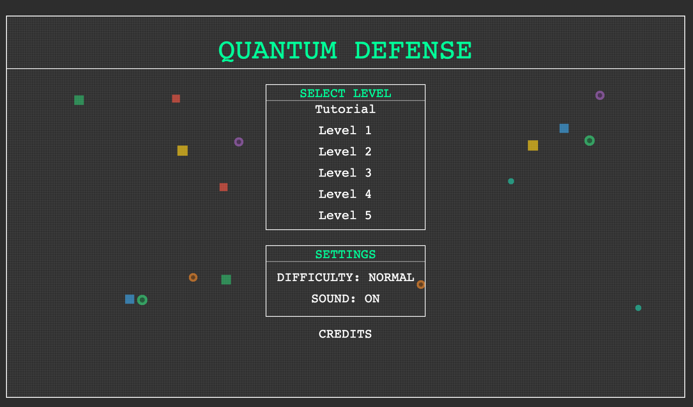
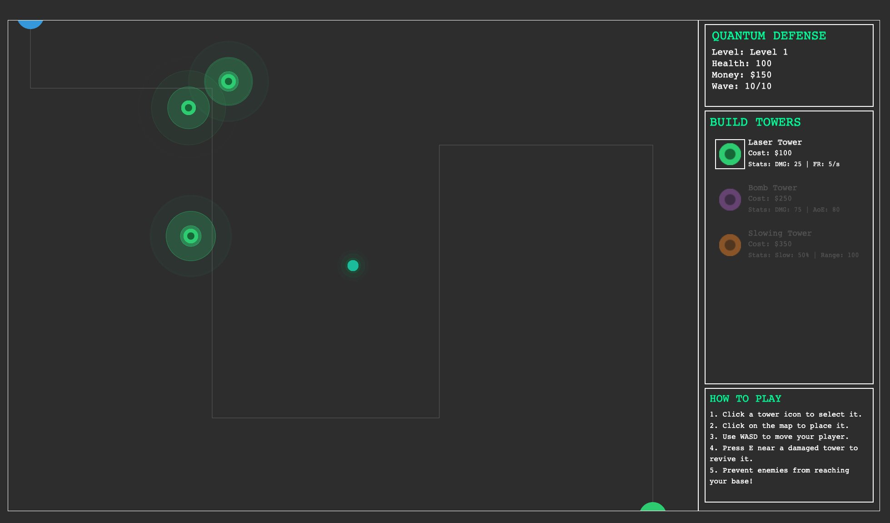
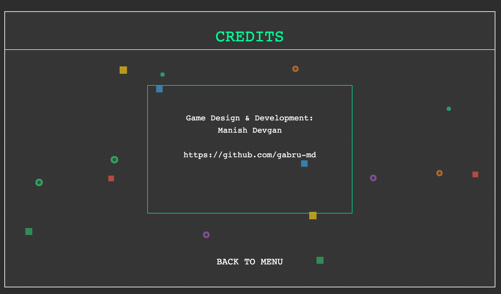

# Quantum Defense

## GitHub Game Off 2025 Entry

**Game Design & Development: Manish Devgan**

---

## About the Game

Welcome to **Quantum Defense**, a unique blend of classic Tower Defense strategy with an active player role, developed
for GitHub Game Off 2025!



In a future where energy waves threaten the quantum realm, you are the last line of defense. Build an array of advanced
towers, strategically placing them to intercept incoming **waves** of digital invaders. But your role isn't just passive
observation – you are the **Quantum Guardian**, an active participant on the battlefield, wielding the power of **waves
** to turn the tide!

---

## Theme: Waves

"Quantum Defense" embraces the "WAVES" theme in multiple exciting ways:

* **Waves of Enemies:** The core challenge revolves around defending against relentless **waves** of diverse enemy
  types, each with unique properties.
* **Player's Wave Amplifier:** Your player character possesses a powerful "Wave Amplifier" ability (activated with 'E').
  This emits a **wave** of energy that can:
    * Revive deactivated towers.
    * Damage special enemies.
* **Tower Visual Pulses:** Your advanced defense towers emit continuous, mesmerizing **visual waves** (pulses) that add
  to the game's vibrant aesthetic.
* **Strategic Waves:** The game itself is a **wave** of escalating strategic challenges, pushing players to adapt their
  defenses and tactics across increasingly difficult levels.

---

## Gameplay Features

* **Hybrid Tower Defense:** Combine classic tower placement strategy with an active, player-controlled hero.
* **Diverse Towers:** Deploy three distinct tower types:
    * **Laser Tower:** Rapid-fire, single-target damage.
    * **Bomb Tower:** Area-of-Effect (AoE) damage for crowd control.
    * **Slowing Tower:** Emits a **wave** that slows down all enemies in its range.
* **Challenging Enemies:** Face off against various enemy types, including:
    * Normal, Fast, and Tanky invaders.
    * **Special Enemies:** These dangerous units can deactivate your towers, requiring direct player intervention!
* **Active Player Abilities:**
    * **Movement:** Navigate the battlefield with WASD.
    * **Bullet Absorption:** Absorb incoming laser bullets, protecting your towers and base.
    * **Wave Amplifier (E):** Use your energy **wave** to revive deactivated towers (at a cost!) or directly damage
      special enemies.
* **Progressive Levels:** Conquer 5 unique levels, each featuring distinct path designs and escalating difficulty.
* **Interactive Tutorial:** A guided tutorial level teaches all core mechanics, including the player's abilities and
  tower interactions.
* **Dynamic UI/UX:**
    * A sleek, "digital vector" aesthetic with vibrant colors and animated elements.
    * Intuitive HUD with real-time stats, tower selection, and contextual help text.
    * Difficulty and sound settings in the main menu.
* **Modular Architecture:** Built with a robust component-based design and manager system for scalability and
  maintainability.

---

## How to Play

**Objective:** Defend your base from incoming waves of enemies. If your base health drops to zero, or if a Special Enemy
reaches the end of the path, it's Game Over! Complete all 5 levels to win.



**Controls:**

* **WASD:** Move your player character.
* **Mouse Click (Game Area):** Place the currently selected tower.
* **Mouse Click (HUD):** Select a tower type from the "BUILD TOWERS" panel.
* **E (Player Ability):**
    * **Near Deactivated Tower:** Revive the tower (costs 2x its original price).
    * **Near Special Enemy:** Damage the Special Enemy.
* **Escape:** Return to the Main Menu from any level.

---

## Installation & Setup

To run Quantum Defense locally:

1. **Clone the repository:**
   ```bash
   git clone https://github.com/gabru-md/quantum-defense.git
   cd quantum-defense
   ```
2. **Install dependencies:**
   ```bash
   npm install
   ```
3. **Build the project:**
   ```bash
   npm run build
   # or simply: tsc
   ```
4. **Open `index.html`:** Navigate to the project root and open `index.html` in your web browser.

---

## Credits


* **Game Design & Development:** Manish Devgan

---

## Technologies Used

* **Phaser 3:** Fast, free, and fun open-source HTML5 game framework.
* **TypeScript:** Strongly typed programming language that builds on JavaScript.

---

## Future Plans (Beyond Game Off)

* More diverse enemy types and boss battles.
* Additional unique tower types with upgrade paths.
* Advanced player abilities and customization.
* Expanded audio library with unique sound effects and music tracks.
* Score tracking and leaderboards.
* More intricate level designs and environmental hazards.

---
